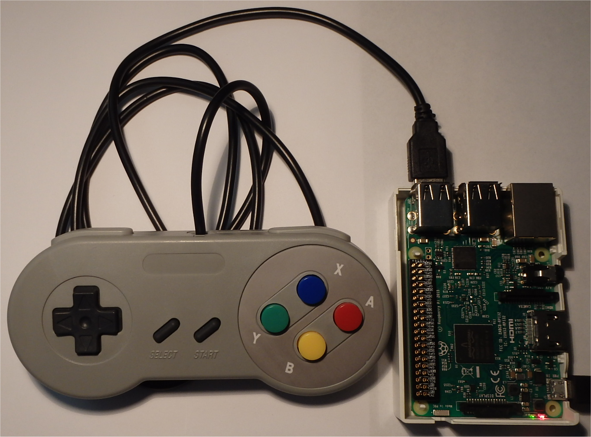
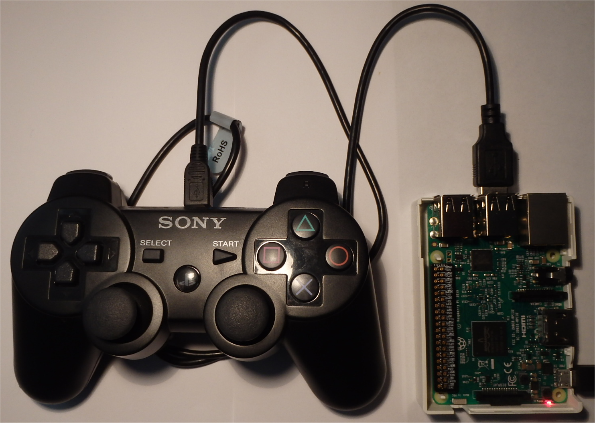

# Pi Python Gamepad Support
Add wireless keywireless keyboard, gamepad or PS2 Controller interfaces to Pi projects

##Introduction

For many Pi projects there is a requirement to have manual controls. These controls could be:
* wireless keyboards
* generic gamepads
* PS2 or X-Box game controllers

For Python users the **_Pygame_** library offers a keyboard and joystick interface, but the Pygame interface is required. 

This project will look at the Python **_evdev_** library which is a generic input events interface

# Python-evdev

The __evdev__ interface serves the purpose of passing events generated in the kernel directly to userspace through character devices that are typically located in __/dev/input/__.

The Python 3 libary is installed by:

```bash
sudo apt-get install python3-pip
sudo pip3 install evdev
```
It is possible to monitor keys from multiple devices connect to the Raspberry Pi (or an Linux devce). For a single device the connection should be on **_/dev/input/event0_**.

A simple monitoring program would be:

```python
from evdev import InputDevice, categorize, ecodes
gamepad = InputDevice('/dev/input/event0')

for event in gamepad.read_loop():
    if event.type == ecodes.EV_KEY and event.value == 1:
        try:
            keyevent = categorize(event)              
            print (keyevent) # comment to remove key messages

        except:
            print ("Problem key pressed...")
```
The output should appear as something like:
```bash
key event at 1488557515.714249, 295 (BTN_BASE2), down
key event at 1488557517.491448, 294 (BTN_BASE), down
key event at 1488557519.594712, 293 (BTN_PINKIE), down
```
By using this output it is possible to discover keys commands. The **_keyevent.keycode_** will appear as an ASCII string, such as BTN_TOP2.

Some important notes:
* not all key code are mapped, so a "Problem key pressed..." will appear for unmapped keys.
* key strokes are addressed in the this project. Joysticks events are found in /dev/input/js0

## Generic Gamepads

There are many low cost generic pads that can be used. Below is a picture of a generic gamepad with some sample code to pick up its keys. (Note: the joystick keys are not addressed in this project).



```python
from evdev import InputDevice, categorize, ecodes
gamepad = InputDevice('/dev/input/event0')

for event in gamepad.read_loop():
    if event.type == ecodes.EV_KEY and event.value == 1:
        try:
            keyevent = categorize(event)
            if keyevent.keycode == "BTN_THUMB":
                print ("Right - 'A' button")
            if keyevent.keycode == "BTN_THUMB2":
                print ("Bottom - 'B' button")
            if 'BTN_TRIGGER' in keyevent.keycode: # ['BTN_JOYSTICK', 'BTN_TRIGGER']
                print ("Top - 'X' button")
            if keyevent.keycode == "BTN_TOP":
                print ("Left - 'Y' button")
            if keyevent.keycode == "BTN_TOP2":
                print ("Left shoulder button")
            if keyevent.keycode == "BTN_PINKIE":
                print ("Right shoulder button")
            if keyevent.keycode == "BTN_BASE3":
                print ("SELECT button")                
            if keyevent.keycode == "BTN_BASE4":
                print ("START button")
                
            print (keyevent) # comment to remove key messages

        except:
            print ("Problem key pressed...")
  ```
  
#PS2 Controllers



Sony PS2 controllers can be directly connected to the Raspberry Pi with a USB cable. 

The key mapping is not the same as a generic keypad. Some issues that we found using PS2 controllers:

* the PS2 controller may require the "PS" key to be pushed before the controller is active
* the right "triangle", "circle" and "X" are not directly supported in the _keyevent.keycode_.

 Below is some Python code topick up the PS2 keys.
 
 ```python
 from evdev import InputDevice, categorize, ecodes
gamepad = InputDevice('/dev/input/event0')

for event in gamepad.read_loop():
    if event.type == ecodes.EV_KEY and event.value == 1:
        try:
            keyevent = categorize(event)
            if 'BTN_TRIGGER_HAPPY1' in keyevent.keycode: #'BTN_TRIGGER_HAPPY', 'BTN_TRIGGER_HAPPY1'
                print ("Playstation button")
                
            if keyevent.keycode == "BTN_TOP2":
                print ("Top D-Pad button")
            if keyevent.keycode == "BTN_BASE":
                print ("Bottom D-Pad button")
            if keyevent.keycode == "(BTN_BASE2":
                print ("Left D-Pad button")
            if keyevent.keycode == "(BTN_PINKIE":
                print ("Right D-Pad button")
                
            if keyevent.keycode == "BTN_BASE5":
                print ("Left top shoulder button")
            if keyevent.keycode == "BTN_BASE6":
                print ("Right top shoulder button")
            if keyevent.keycode == "BTN_BASE3":
                print ("Left bottom shoulder button")
            if keyevent.keycode == "BTN_BASE4":
                print ("Right bottom shoulder button")

            if "BTN_TRIGGER" in keyevent.keycode: #'BTN_JOYSTICK', 'BTN_TRIGGER'
                print ("SELECT button")                
            if keyevent.keycode == "BTN_TOP":
                print ("START button")

            if keyevent.keycode == "BTN_DEAD":
                print ("SQUARE button")

                
            print (keyevent) # comment to remove key messages

        except:
            print ("Problem key pressed...") 
 ```
 


